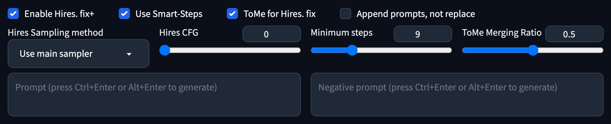

# Hires. fix Plus
Add more optional parameters and ToMe to Stable Diffusion WebUI's Hires. fix  

## About
This extension can add more available parameters and Token Merging support to SD WebUI's "Hires. fix" by hijacking txt2img output and running a custom img2img process  

## Screenshot
  

## Usage
If you want to use Hires.fix+, please enable `Hires.fix` first, then check `Enable Hires.fix+`. After that you can set the additional parameters.  

- **Use Smart-Steps**  

	> Use the formula: $\log_{s}{10}\cdot ds$ to calculate the most cost-effective number of iterations
	
- **ToMe for Hires. fix**  
	> Use Token Merging (tomesd) during the Hires. fix process to increase the iteration speed
	
- **Append prompts, not replace**
	> Append the extra prompts to the original prompts instead of replacing it
	
- **Hires Sampling method**
	> Set a different sampler than txt2img for Hires. fix
	
- **Hires CFG**
	> Set a different CFG Scale value than txt2img for Hires. fix

- **Minimus steps**
	> If Smart-Step is enabled, the number of iterations for Hires. fix will never be less than this
	
- **ToMe Merging Ratio**
	> The larger the value, the faster the iteration speed, but the worse the image details
	
## Install
1. Go to SD WebUI's extension tab
2. Click `Install from URL` subtab
3. Paste `https://github.com/lihaoyun6/sd-webui-Hires-fix-Plus` into the URL textbox
4. Click Install and wait for it to complete
5. Once completed, the WebUI needs to be reloaded

## Credits
- Inspired by [stable-diffusion-webui-hires-fix-progressive](https://github.com/Kahsolt/stable-diffusion-webui-hires-fix-progressive) @Kahsolt  
- [Stable Diffusion web UI](https://github.com/AUTOMATIC1111/stable-diffusion-webui) @AUTOMATIC1111  
- [Token Merging for Stable Diffusion](https://github.com/dbolya/tomesd) @Bolya, Daniel and Hoffman, Judy  
