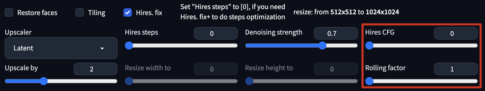

# Hires. fix Plus
[[中文版]](./README_zh.md)  
This extension can add more available parameters and "rolling generation" support to SD WebUI's "Hires. fix" by hijacking txt2img sample method  
(Hires prompts/Hires sampler and Hires ToMe has been supported by SD WebUI, so they have been removed from HF+)  

## Screenshot
  

## Usage
Description of some functions:  

- **Steps optimization**  

	> Hires. fix+ will use the formula: $\log_{s}{10}\cdot ds$ to calculate the most cost-effective number of iterations  
	> PS: This is enabled by default, but if you set the value of `Hires steps`, this feature will be disabled automatically  
	
- **Hires CFG**
	> Set a different CFG Scale value than txt2img for Hires. fix  

- **Rolling factor**
	> If it's not 1.0, HF+ will do multiple times of img2img to upscale the image to the target resolution, and each time the image will be upscaled by this factor  
	> PS: This can generate more details than normal Hires. fix, and improves the output quality of the latent space upscaler

- **Settings**
	> The extension will add a `Hires. fix+` group in the `Settings`, where you can access some other options  
	
## Install
1. Go to SD WebUI's `extension` tab
2. Click `Install from URL` subtab
3. Paste `https://github.com/lihaoyun6/sd-webui-Hires-fix-Plus` into the URL textbox
4. Click `Install` and wait for it to complete
5. Once completed, the WebUI needs to be reloaded

## Credits
- [Stable Diffusion web UI](https://github.com/AUTOMATIC1111/stable-diffusion-webui) @AUTOMATIC1111  
