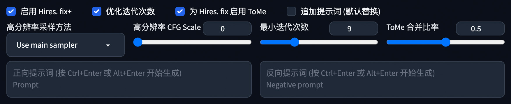

# Hires. fix Plus
为 SD WebUI 的高分辨率修复功能添加更多自定义参数以及 ToMe 支持. 

## 简介
本插件通过劫持文生图的输出图像并运行自定义的图生图过程来模仿原生的 Hires. fix 功能.  
比原版引入了更多参数, 以及仅针对高分辨率修复阶段的 ToMe 优化 (不会影响文生图结果).

## 截图
  
 

## 使用说明
要使用此插件, 请同时启用 `Hires.fix` 和 `Enable Hires.fix+`. 然后可以设置下列任何附加参数:  

- **Use Smart-Steps** (优化迭代次数)

	> 使用公式: $\log_{s}{10}\cdot ds$ 来在保证出图质量的情况下尽可能减少迭代次数, 提升出图速度  
	
- **ToMe for Hires. fix** (为 Hires. fix 启用 ToMe)
	> 在高分辨率修复阶段启用 ToMe Merging 优化器以提升出图速度, 但会损失少量画面细节  
	
- **Append prompts, not replace** (追加而非替换提示词)
	> 将自定义提示词追加到文生图提示词末尾, 并用于高分辨率修复. 如不勾选此项, 则将会在高分辨率修复时忽略文生图提示词, 完全使用自定义提示词  
	> (当用户没有输入自定义提示词时, 此选项无意义)
	
- **Hires Sampling method** (高分辨率采样方法)
	> 允许用户为高清修复设置与文生图不同的采样器  
	
- **Hires CFG** (高分辨率 CFG Scale)
	> 允许用户为高清修复设置与文生图不同的CFG Scale值  

- **Minimus steps** (最小迭代次数)
	> 当启用`优化迭代次数`选项后, 最终计算出的目标迭代次数将不会小于此值
	
- **ToMe Merging Ratio** (ToMe 合并比率)
	> 此值越大, 则ToMe的作用效果越强, 迭代速度越快; 但图像细节损失也会越多.
	
## 安装
1. 前往 SD WebUI 的 `扩展` 标签页
2. 点击 `从网址安装` 子标签
3. 将 `https://github.com/lihaoyun6/sd-webui-Hires-fix-Plus` 粘贴进网址输入框
4. 点击 `安装` 并等待完成
5. 提示安装成功后重载 WebUI 即可启用

## 鸣谢
- 灵感来源: [stable-diffusion-webui-hires-fix-progressive](https://github.com/Kahsolt/stable-diffusion-webui-hires-fix-progressive) @Kahsolt  
- [Stable Diffusion web UI](https://github.com/AUTOMATIC1111/stable-diffusion-webui) @AUTOMATIC1111  
- [Token Merging for Stable Diffusion](https://github.com/dbolya/tomesd) @Bolya, Daniel and Hoffman, Judy  
